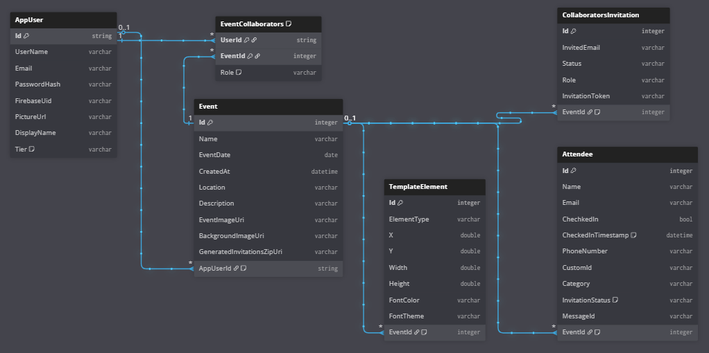

# QrPlatform - Event & Invitation Management API

[](https://dotnet.microsoft.com/)

A comprehensive RESTful API built with ASP.NET Core for managing events, attendees, and collaborators, featuring a tiered freemium/pro model and asynchronous invitation generation.

## Project Overview

QrPlatform is a backend system designed to provide a complete, scalable solution for event organizers. It handles the entire event lifecycle, from user authentication and event creation to complex permission management and automated, non-blocking generation of QR-coded invitations. The architecture is built to be robust and maintainable, following modern .NET best practices.

## Project Demo

Below is a short preview that demonstrates the creation of a "Pro" tier event to downloading the final ZIP file containing all the personalized invitation images.

**Click the GIF to watch the full, high-definition project demonstration on YouTube.**

[](https://youtu.be/Cqn0iufXll8)

This short video demonstrates the end-to-end user flow, from creating a "Pro" tier event to downloading the final ZIP file containing all the personalized invitation images.

## Key Features

*   **Secure User Authentication & Sync:**  Integrates with **Firebase Authentication** for handling user sign-up and login, with a sync process to keep the application's database up-to-date.

*   **Event & Attendee Management:** Full CRUD (Create, Read, Update, Delete) functionality for events and attendees. Supports bulk attendee create, edit and delete, with robust server-side validation.
*   **Tiered Subscription Model (Freemium/Pro):** API features are gated based on user subscription levels, managed through custom attribute filters.
*   **Role-Based Access Control (RBAC):** Features a robust, role-based permission system with distinct roles (**Owner**, **Editor**, **Check-In Staff**). Implements complex business logic for creator privileges and rules to ensure event ownership is never lost, demonstrating a deep understanding of authorization patterns.

*   **Asynchronous & Customizable Invitation Generation:** Leverages **Hangfire** for non-blocking background processing to generate personalized invitation images with embedded QR codes. The system is designed for customization, supporting different background images and a variety of **custom fonts** to match event branding.

*   **Automated WhatsApp Invitations & Status Tracking:** Integrates with the **Wasender API** to send generated invitations directly to attendees via WhatsApp. Includes a dedicated **webhook endpoint** to receive real-time delivery status updates (`Sent`, `Delivered`, `Read`), providing valuable feedback to the event organizer.

## Project Architecture

This API is built with a modern, clean architecture that emphasizes separation of concerns, testability, and scalability. The design makes heavy use of ASP.NET Core's dependency injection and middleware pipeline.

1.  **Controllers (`EventController`, `AccountController`)**:
    *   Serve as the primary entry point for all HTTP requests.
    *   Inherit from a `BaseApiController` which provides a standardized `HandleResult` method. This method inspects the `Result` object from the service layer and returns the appropriate HTTP response (e.g., `Ok`, `NotFound`, `BadRequest`, `Forbidden`). This keeps the controller actions clean and focused on orchestration.

2.  **Custom Action Filters (`Filters` directory)**:
    *   These attributes are a cornerstone of the architecture, handling cross-cutting concerns before the controller action is ever executed.
    *   `[LoadUser]`: Fetches the authenticated `AppUser` from the database using the Firebase UID from the JWT and adds it to the `HttpContext.Items` for easy access in subsequent layers, avoiding redundant database calls.
    *   `[SubscriptionCheck]`: Checks if the user's subscription tier (`Free` or `Pro`) allows them to perform the requested action (e.g., create a "Pro" event).
    *   `[CheckEventPermission]`: The core of the RBAC system. It verifies if the user's role within a specific event (Owner, Editor, etc.) grants them permission to perform the action (e.g., delete an event, add a collaborator).

3.  **Service Layer (`Services` directory)**:
    *   This layer contains the core business logic of the application.
    *   **`ImageGenerationService`**: Uses **SkiaSharp** to draw text and QR codes onto background images.
    *   **`FileHandlingService`**: Logic for parsing uploaded `.xlsx` and `.csv` files.
    *   **`WhatsAppService` / `EmailService`**: Encapsulates logic for communicating with external messaging and email APIs.

4.  **Repository Layer (`Repository` directory)**:
    *   Abstracts all data access logic using the Repository Pattern.
    *   Controllers and services interact with repository *interfaces* (`IEventRepository`), not directly with the `AppDBContext`. This decouples the business logic from the data access technology (Entity Framework Core).
    *   Handles all the complex database queries, including joins, filtering, and permission checks.

5.  **Robust Error Handling (`ExeptionHandling` directory)**:
    *   **`Result<T>` Pattern**: Instead of throwing exceptions for predictable failures (e.g., "Event not found"), methods return a `Result` object. This object indicates either success (with a value) or failure (with a specific `Error` type). This leads to cleaner, more predictable code flow.
    *   **`GlobalExceptionHandler`**: A middleware that catches any *unexpected* exceptions that occur anywhere in the application. It logs the error and returns a generic `500 Internal Server Error` response, preventing stack traces from leaking to the client.
    *   **`Errors.cs`**: A static class containing predefined, strongly-typed `Error` objects (e.g., `EventErrors.EventIdNotFound`). This prevents magic strings and ensures consistency in error codes and messages.

6.  **Background Jobs (`Hangfire`)**:
    *   Heavy or long-running tasks are offloaded to Hangfire.
    *   When a "Pro" event is created, the controller immediately returns a `202 Accepted` response. A background job is enqueued for the `ImageGenerationService` to process all the invitations without blocking the user. The client can then poll a download endpoint to check the job's status.

### Database Schema

The database is designed with a relational structure to efficiently manage events, users, attendees, and their complex relationships, including collaborators and invitations.




## API Documentation

The complete API specification is available as a PDF within this repository. 

**[Click here to view the API Documentation](Docs/QrPlatform_API_Specification_2.0.pdf)**

A summary of key endpoints is detailed within the documentation.

## Tech Stack

*   **Framework:** **ASP.NET Core 8**
*   **Database:** Entity Framework Core with SQL Server
*   **Authentication:** Firebase Authentication (JWT)
*   **Background Jobs:** Hangfire
*   **API Testing:** Postman
*   **Language:** C#
*   **Image Processing**: **SkiaSharp** & **SkiaSharp.HarfBuzz** (for complex text shaping)
*   **QR Code Generation**: **QRCoder**
*   **Excel File Parsing**: **NPOI**
*   **Validation**: **FluentValidation**
*   **API Documentation**: Swagger / OpenAPI

## Getting Started

To run this project locally:

### Prerequisites

*   [.NET 8 SDK](https://dotnet.microsoft.com/en-us/download/dotnet/8.0)
*   Microsoft SQL Server
*   A Firebase project for authentication.

### Installation & Setup

1.  **Clone the repository:**
    ```sh
    git clone https://github.com/Null-AH/EventsWebsite.git
    ```
2.  **Configure `appsettings.json`**
    You will need to provide your own credentials for:
    *   The database `ConnectionString`.
    *   Firebase project details (`ProjectId`, `WebApiKey`).
    *   Email/WhatsApp service API keys.
    *   Download your Firebase service account key (`firebase-adminsdk.json`) and place it in the root of the project.
3.  **Apply database migrations:**
    ```sh
    dotnet ef database update
    ```
4.  **Run the application:**
    ```sh
    dotnet run
    ```
## Acknowledgements

This API was built to serve as the backend for the complete QrPlatform application. The project was a collaborative effort:

*   **Backend API**: Developed by **Ahmad Hazem** ([GitHub](https://github.com/Null-AH)) ([LinkedIn](https://www.linkedin.com/in/ahmed-almazni/))
*   **Frontend Application**: Developed by **Mahmoud Abbas** ([GitHub](https://github.com/76mas)) ([LinkedIn](https://www.linkedin.com/in/mahmoud-abbas-104ab9257/))

A huge thank you to my friend and collaborator for his excellent work on the user interface and frontend logic.
